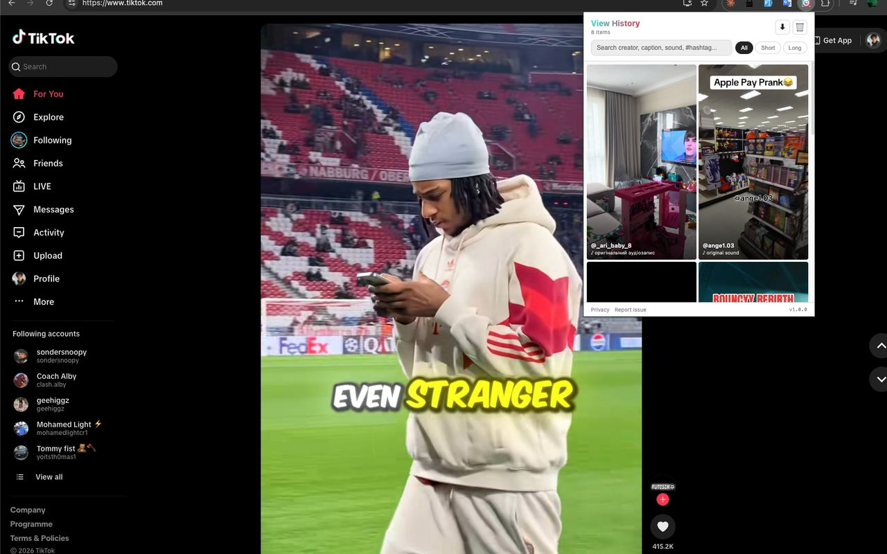

# TikTok View History

Automatically tracks the TikTok videos you view in the browser so you can find them again later. Everything stays in your browser — no servers, no analytics, no tracking.



## What it does

Scroll TikTok like you normally would. In the background, this extension quietly records the videos that appear in your feed. Open the popup anytime to browse, search, or filter your history.

- Automatic capture — no manual saving, no "like" needed
- 9:16 vertical grid that matches TikTok's native format
- Search by creator, caption, sound name, or hashtag
- Filter: all / short (<30s) / long (≥30s)
- Delete items individually or clear all
- Export history as JSON

## Privacy

No data leaves your device. Ever.

All history is stored locally using `chrome.storage.local`. The extension makes zero outbound network requests of its own and has no analytics. Uninstalling removes everything.

Full details: [privacy-policy.md](./privacy-policy.md)

## Install

Until the extension is live on the Chrome Web Store, you can load it manually:

1. Clone or download this repo
2. Open `chrome://extensions`
3. Enable "Developer mode" (top right)
4. Click "Load unpacked" → select this folder

## How it works

The extension injects a lightweight interceptor into `tiktok.com` that observes TikTok's own feed API responses as they arrive in the page. When a feed response (FYP, Following, Profile, etc.) comes through, the relevant metadata (video id, thumbnail, caption, author, sound, hashtags, duration) is passed to the background service worker and stored locally.

Source layout:

```
src/
├── background.js        Service worker — storage.local I/O
├── injector.js          Content script — loads interceptor into page context
├── interceptor.js       Page-context module — hooks fetch/XHR, calls parser
├── popup.html           Popup UI
├── popup.js             Popup logic — safe DOM render, search, filter, export
└── lib/
    └── parser.js        Pure ES module — response parser + endpoint classifier

tests/
├── fixtures/            Real TikTok feed response captured from the wild
└── parser.test.js       node --test suite exercising the parser
```

No bundler, no build step. Plain JS, MV3. Unit tests run with `npm test` (uses Node's built-in `node:test`, no runtime dependencies).

## Contributing

Issues and PRs welcome. This is a hobby project — don't expect enterprise-grade support, but real bug reports will get real responses.

## License

MIT — see [LICENSE](./LICENSE).
